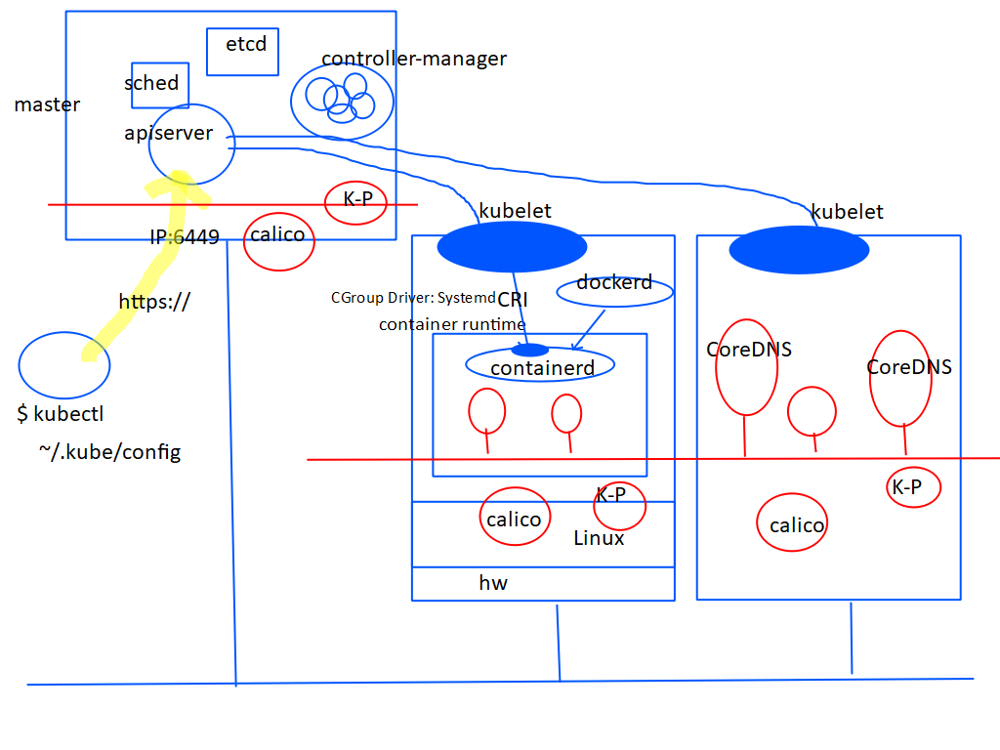

  
[링크](http://edu.openhpc.or.kr/openhpc/educ/offline/offlineDetailView.do?offlineId=OFL000000000000117)

중점적으로 얘기할것들
os, 가상화,  filesystem, docker, containerd, cri, kubernetes , network

quiz. 어플리케이션을 개발할때 하드웨어에 대해 신경쓰시나요?


# OS 구조에 대한 두가지 관점
- 어플리케이션
- 쉘
- 커널

``` c
    a = a + 1                  // 커널 접근 없음
    printf("HelloWorld");      // 커널 접근
```

- BUSY 
  - USER MODE : 유저가 실행 
  - SYSTEM MODE : 커널에서 실행 
- IDLE

시스템콜 :  
  - 운전 면허 : 전기 자동차 면허, 내연 기관 자동차 면허 따로있지 않다. 인터페이스 동일하기 때문
  - POSIX : `Portable Operating System not unix ` 인터페이스에 대한 표준
  - firm ware : 하드웨어가 제공해, 근데 소프트웨어야.  그래서 하드웨어와 커널 사이에 위치

```
/dev/eth0
리눅스는 모든디바이스가 파일 같음.
그래서 폴더에서 접근해서 디바이스 읽고 씀
```

# `가상`化 (virtualization)
ex) 데이터센터 가상화, 스토리지, 네트워크, 메모리  
물리적인 자원 (physical resources) -> 논리적인 자원 으로 만드는것을 가상화 라고 한다.

물리적인자원  
 : 고정된형태/정해진 크기/ 재구성하기 어렵다  
논리적인 자원?  
 : 고정되어 있지 않은 형태/ 재구성할수 있는/크기 가변적  


supervisor : 장비의 관리하는사람?  
hiypervior : 슈퍼바이저와 구분이 필요해져서 나오기 시작  


os 가 가상화 소프트웨어와 합쳐져 있으면 type1  
os 가 가상화 소프트웨어와 합쳐져 있지 않으면 type2 (window에 vmware 설치해서 쓰는거)  

guest os : vm 에서 올라가는 os


VM에서 해당 코드를 실행한다면
```
a = a + 1
printf("Hello World");


LD $a, r3
ADD r3, #1
ST r3, $a
```

인스트럭션이 호스트 CPU로 한번에 가지 않음. 이유는?
1. 호스트 PC 의 CPU 와 게스트 PC의 CPU 가같지 않을수 있음.
2. 어드레스 스펙이 다름

amdv, intel vtx : cmos 에서 켜고 끄고 할수 있음. 가상화된 인스트럭션을 호스트 PC에서 바로 사용할수 있음.


## PARA virtualization  반가상화
게스트OS 가 하이퍼콜을 함  


# ISOLATION 이 주는 장점
## infra 관리측면
장애격리  
관리분리  
on/off 별도 진행  
## OS격리
OS 문제 발생시 격리  
## app 격리
개발 측면 유리  

## 격리 에 필요한 것 들 ?
```
hostname <- OS
IP
FileSystem
process
user
ipc
```

# 유닉스의 게스트 계정 은 어떻게 동작 할까
```
chroot /home/guest          // 루트를 변경 시켜서 여기서 못 벗어나게함. 다른곳 접근 차단해서 시스템 보호 한다.
choroot jail 이라고 부름
```

jail 이라는 용어가 안좋아서 container 되었다 카더라. 어쨋든 정해진 구역에서 보여지는 환경. 도커에서 용어를 만들어서 컨테이너라는 용어로 쓰임. 프로세스의 격리된 환경

`LXC` 에서 기술이 발생하였지만 `AppContainer` Containerd가 쓰임
발전과정은 lxc -> labcontainer -> oci -> containerd

컨테이너별 네임스페이스 격리, cgroup 으로 그룹으로 구분하며, 시분할시켜 자원을 사용/배분하여 관리함
리눅스 커널 3.08 부터 쓸만해짐.

https://en.wikipedia.org/wiki/Linux_namespaces
https://en.wikipedia.org/wiki/Cgroups

차등화된 스케쥴링 기능이 필요해져서 control 가능하게 만듦 -> cgruop
격리된 환경을 제공 -> namespace

# 도커의 핵심 기술은
`컨테이너가 사용하는 파일시스템환경을 다른 컨테이너로 실행 시킬수 있게함`

- 일반적인 개발은 install 파일을 만들어서 설치하라고 전달함. 설치가 안되면, 왜그러지? 환경에 구애받음
- 도커파일 만들어서 운영 환경에서 배포. 환경에 구애받지않음

소프트웨어 배포에 최적화된 플랫폼
----------------------------------------------------------------


# Union File System
Union Mount Filesystem  
Layered File System  
Overlay fileSystem(Overlay FS 2)  
```$ aufs / devicempper / ...```

OHP (Overhead Projector 처럼 필름을 올려서 사용하는 컨셉)

윈도우의 경우 드라이브레터 c: d:
유닉스의 경우 하나의 파일시스템에 루트를 지정하여 사용. 말이 있고 그거에 올라타는 것과 비슷하여 마운트라고함 (마운트라는 명령어로 확인 가능함)

마운트 해제 명령어  
```$ umount```


파일의 구조 :  
파일시스템의 구조 :  
마운트의 구조 : 파일시스템들을 엮어서 큰 루트 파일 시스템을 만드는것  


도커의 경우 아래는 readonly , 맨위만 writable 가능한 레이어 구조로 함

컨테이너는 업데이트와 배포에 유리한 구조임


# 도커 설치
## 도커 설치
``` sh
wget -qO- https://get.docker.com | sh -
```

## ssh 설치
``` sh
sudo apt install openssh-server

sudo systemctl enable ssh --now ssh
sudo systemctl status ssh
sudo ufw status         //firewall 검사
ssh kcia@localhost      
```

## hostname 세팅
``` sh
hostnamectl set-hostname --static k8s-21-1
```

## docker 확인
``` sh
type docker 
ls -l /usr/bin/docker
```

## 유닉스 도메인 소켓으로 만들어짐. 파일시스템임. 소켓 파일인걸 확인하자
## docker.sock는 root 와 docker 그룹에서 실행 가능한걸로 확인 된다.
``` sh
ls -l /var/run/docker.sock
srw-rw---- 1 root docker 0 May 28 12:35 /var/run/docker.sock
srw 의 s는 소켓파일임
```

## kcia 유저는 루트도 아니고, 도커유저도 아니기때문에  접근이 불가함. 루트로 접근하거나, docker 그룹을 부여하는방법
``` sh
tail /etc/group
sudo usermod -aG docker kcia
tail /etc/group
id
```

## /etc/hosts 추가
``` sh
sudo vi /etc/hosts
#아래 라인 추가한다.
10.100.152.151 k8s-21-1
10.100.152.152 k8s-21-2
```

## 도커 스왑을 꺼주는게 좋다.
``` sh
cat /proc/swaps
swapoof -a
sudo vi /etc/fstab 
# swapfile 주석 처리한다
```

리눅스 재시작!
설치 확인하기
``` sh
ip a
id
cat /proc/swaps
docker version
ls -l car/run/docker.sock
```

# Docker Architecture
1. Docker Host /server /Engine
2. Docker Client
3. Registry


quiz. `docker run -it ubuntu:14.04 bash` 하여 os 버전을 확인한다면 어떻게 될까?

도커 컨테이너 실행되는 이미지 및 정보
``` sh
kcia@k8s-21-1:~$ ls -ld /var/lib/docker
drwx--x--- 12 root root 4096  5\uc6d4 21 14:15 /var/lib/docker
kcia@k8s-21-1:~$ sudo -i
[sudo] password for kcia: 
root@k8s-21-1:~# cd  /var/lib/docker
root@k8s-21-1:/var/lib/docker# ls -l
total 44
drwx--x--x 4 root root 4096  5\uc6d4 21 11:52 buildkit
drwx--x--- 3 root root 4096  5\uc6d4 21 16:04 containers
-rw------- 1 root root   36  5\uc6d4 21 11:51 engine-id
drwx------ 3 root root 4096  5\uc6d4 21 11:51 image
drwxr-x--- 3 root root 4096  5\uc6d4 21 11:51 network
drwx--x--- 8 root root 4096  5\uc6d4 21 16:04 overlay2
drwx------ 4 root root 4096  5\uc6d4 21 11:51 plugins
drwx------ 2 root root 4096  5\uc6d4 21 14:15 runtimes
drwx------ 2 root root 4096  5\uc6d4 21 11:52 swarm
drwx------ 2 root root 4096  5\uc6d4 21 16:04 tmp
drwx-----x 2 root root 4096  5\uc6d4 21 14:15 volumes
root@k8s-21-1:/var/lib/docker# 
```

커널의 버전은.. 같다..
```
kcia@k8s-21-1:~$ uname -r
6.5.0-35-generic
kcia@k8s-21-1:~$ uname -a
Linux k8s-21-1 6.5.0-35-generic #35~22.04.1-Ubuntu SMP PREEMPT_DYNAMIC Tue May  7 09:00:52 UTC 2 x86_64 x86_64 x86_64 GNU/Linux
kcia@k8s-21-1:~$ docker run -it ubuntu:14.04 bash

root@fa3ac662ca37:/# uname -r
6.5.0-35-generic
root@18573bc586b4:/# uname -a
Linux 18573bc586b4 6.5.0-35-generic #35~22.04.1-Ubuntu SMP PREEMPT_DYNAMIC Tue May  7 09:00:52 UTC 2 x86_64 x86_64 x86_64 GNU/Linux
```

https://containerd.io
containerd는 oci 표준을 구현한 레퍼런스
cri-o 는 쿠버네티스에서 사용하는 containerd 의 오버헤드를 줄인 플러그인


---------------------------------------------------------------------------------------------
Cattle Business vs Pet Business
Stateless vs Stateful


# 컨테이너 네트워크  
  컨테이너간 통신을 하려면 오버레이 네트웍이 필수임  
  파드네트워크 = 컨테이너네트워크 = 오버레이네트워크 비슷한 말임  

  오버레이네트워크는 L3 L2 인켑슐레이트 기술

  쿠버네티스에서는 다 구현할수 없어서 스펙만 정의하고 container network interface (CNI) 라고 부른다! . 잘하는 업체에 믿고 맡겨!

# 쿠버네티스
https://kubernetes.io/
  
디자이어드 스테이트가 벗어나면 힐링, 워크로드가 많아지면 스케일링, 오토메이션

Horizontal scaling은 시스템에 노드를 추가하거나 제거하여 숫자를 조정하는 scale out/in을 의미합니다.
vertical scaling 스펙을 늘리는 스케일링 scale up/down


CRI Container Runtime Interface

containerd가 만들어진 배경은
oci(Open container initiative) 때문에 만들어짐. containerd가 다시 만든게 도커 


발빠르게 스케일아웃, 
B2C에 더 적합함. B2B보다는 


## 마스터
 컨트롤 플레인이라고도 불렸음
 API 서버가 구동되고 있음

## 노드
 쿠블릿이 구동되고 있음. 
 컨테이너런타임(container runtime, docker, ciro))이 있음 

## 쿠버네티스 명령은 
- 우리 컨테이너는 이 모양으로 떠있게 해주세요. 점잖게 얘기함. 결과만 얘기하면됨
- manifest 파일은 yaml, json을 지원하며 내부에서는 json으로 통신함. 쓰기엔 yaml 이 편함
- 장애에 대한 대처가 가능, 변경에 대한 대응 가능
  - actualstate 가 바뀌는건 장애.
  - desiredstate 가 바뀌는건 변경.

- kubelet 은 리눅스 서비스 프로세스임
- container runtime 리눅스 서비스프로세스
- kube-proxy 컨테이너 내에 포함됨


considering for large clsuters
최대 노드는 5000개

Considerations for large clusters
A cluster is a set of nodes (physical or virtual machines) running Kubernetes agents, managed by the control plane. Kubernetes v1.30 supports clusters with up to 5,000 nodes. More specifically, Kubernetes is designed to accommodate configurations that meet all of the following criteria:

No more than 110 pods per node
No more than 5,000 nodes
No more than 150,000 total pods
No more than 300,000 total containers
You can scale your cluster by adding or removing node

https://kubernetes.io/docs/setup/best-practices/cluster-large/


api server가 kubelet들을찾아다니지않음 (5000개를 일일이 찾아 다니지 않아도됨)

kubelet들이 칠판에 일거리를 찾아옴

api server가 kubelet을 찾아가는ㄱ ㅕㅇ우는 문제가생겼ㅇㄹ경우만 빼고는 없음


``` sh 
sudo apt update 
sudo apt install -y qemu-guest-agent

ip a
sudo hostnamectl set-hostname --static k8s-1-1
sudo hostnamectl set-hostname --static k8s-1-2

sudo vi /etc/hosts
10.100.152.111 k8s-1-1
10.100.152.112 k8s-1-2

sudo vi /etc/fstab
#/swapfile                                 none            swap    sw              0       0

sudo systemctl disable systemd-resolved.service
sudo systemctl stop systemd-resolved

sudo vi /etc/NetworkManager/NetworkManager.conf
dns=default

sudo rm /etc/resolv.conf

sudo systemctl restart NetworkManager.service
cat /etc/resolv.conf

wget -qO- https://get.docker.com | sh -
```




팟안에 컨테이너가 있고 , 컨테이너는 여러가지 컨테이너가 있을수 있음.


여러개의 컨테이너가 뜰 수 있음
helper conainer , support conainer

## POD
파드(Pod) 는 쿠버네티스에서 생성하고 관리할 수 있는 배포 가능한 가장 작은 컴퓨팅 단위

팟은 기본적으로 호스트하고 네트워크는 격리시킴
컨테이너가 뜨면 pid, 파일시스템은 컨테이너 단위로 격리

오버레이 네트워크의 vxlan gre 프로토콜

팟은 호스트는 하나, 네트워크 하나로 생각


Repicaset 이 새로 나온 이유
Replicaioncontroller 로는 deployment를모만들어서 새로 만듬

롤아웃
 새버전 구버전 배포후 트래픽을 변경하는거

 https://kubernetes.io/docs/reference/generated/kubernetes-api/v1.30/

### POD life cycle
 Phase: `Pending`, `Running`, `Succeeded`, `Failed`, `Unknown` 5개의 상태가 있음  


## Services
DNS 호스트 네임 역할을 해줌
서비스 자원을 만들고,  팟 내부에서는 서비스이름으로 접근
kube-proxy가 레이블을 보고 결정함
보내는건 CNI 플러그인들이 하는거

quiz. POD만 있으면 되지 Service는 왜 있는걸까요?

## Play With Kubernetes

## Insalling kube adm
https://kubernetes.io/docs/setup/production-environment/tools/kubeadm/install-kubeadm/
https://www.cherryservers.com/blog/install-kubernetes-on-ubuntu 


## Installing Kubernetes
```sh

cat <<EOF | sudo tee /etc/modules-load.d/k8s.conf
overlay
br_netfilter
EOF

sudo modprobe overlay
sudo modprobe br_netfilter

cat <<EOF | sudo tee /etc/sysctl.d/k8s.conf
net.bridge.bridge-nf-call-iptables  = 1
net.bridge.bridge-nf-call-ip6tables = 1
net.ipv4.ip_forward                 = 1
EOF

sudo sysctl --system
sudo apt-get install -y apt-transport-https ca-certificates curl
sudo mkdir /etc/apt/keyrings
curl -fsSL https://pkgs.k8s.io/core:/stable:/v1.30/deb/Release.key | sudo gpg --dearmor -o /etc/apt/keyrings/kubernetes-apt-keyring.gpg
echo 'deb [signed-by=/etc/apt/keyrings/kubernetes-apt-keyring.gpg] https://pkgs.k8s.io/core:/stable:/v1.30/deb/ /' | sudo tee /etc/apt/sources.list.d/kubernetes.list

sudo apt-get update
sudo apt-get install -y kubelet kubeadm kubectl
sudo apt-mark hold kubelet kubeadm kubectl

sudo sh -c "containerd config default > /etc/containerd/config.toml"
sudo sed -i 's/ SystemdCgroup = false/ SystemdCgroup = true/' /etc/containerd/config.toml

sudo systemctl restart containerd.service
sudo systemctl restart kubelet.service
sudo systemctl enable kubelet.service
```

```sh
sudo kubeadm config images pull
sudo kubeadm init --pod-network-cidr=10.10.0.0/16

초기화 는
sudo kubeadm reset
sudo kubeadm init

설치완료되면 worker 노드에ㅓ
kubeadm join 10.100.152.111:6443 --token pfdyn9.23d9hzsly6xnfdlp \
        --discovery-token-ca-cert-hash sha256:15c18ed06c6923211e3833035d00cee8c6fb95e86cc9a7f41563764722dd7d8c

kubectl get node

```


Addon 설치
Installaion Calico
```sh
https://docs.tigera.io/calico/latest/getting-started/kubernetes/quickstart#:~:text=Install%20Calico%201%20Install%20the%20Tigera%20Calico%20operator,node%20in%20your%20cluster%20with%20the%20following%20command.


kcia@k8s-1-1:~$ kubectl get pod --all-namespaces -o wide
NAMESPACE         NAME                               READY   STATUS    RESTARTS        AGE     IP               NODE      NOMINATED NODE   READINESS GATES
kube-system       coredns-7db6d8ff4d-4cncq           0/1     Pending   0               64m     <none>           <none>    <none>           <none>
kube-system       coredns-7db6d8ff4d-77h2s           0/1     Pending   0               64m     <none>           <none>    <none>           <none>
kube-system       etcd-k8s-1-1                       1/1     Running   0               69m     10.100.152.111   k8s-1-1   <none>           <none>
kube-system       kube-apiserver-k8s-1-1             1/1     Running   0               69m     10.100.152.111   k8s-1-1   <none>           <none>
kube-system       kube-controller-manager-k8s-1-1    1/1     Running   7 (5m21s ago)   69m     10.100.152.111   k8s-1-1   <none>           <none>
kube-system       kube-proxy-d4mbl                   1/1     Running   0               64m     10.100.152.111   k8s-1-1   <none>           <none>
kube-system       kube-proxy-r7qsx                   1/1     Running   0               24m     10.100.152.112   k8s-1-2   <none>           <none>
kube-system       kube-scheduler-k8s-1-1             1/1     Running   7 (6m26s ago)   69m     10.100.152.111   k8s-1-1   <none>           <none>
tigera-operator   tigera-operator-76ff79f7fd-bwc7p   1/1     Running   0               5m49s   10.100.152.112   k8s-1-2   <none>           <none>


```

-------------------------
#


## 데몬셋
모든 노드에 한개씩 떠야함

라이브니스프로브를 설정 안하면 pid 1 번으로 팟 죽었는지 판단함

## kube-proxy
넷필터를 통해 cni 통신 실패난걸 K8S 서비스리소스에 있는지 확인해서 레코드를 확인해서 응답해줌


드레인
노드에 더이상 스케쥴링 하지 않도록 알려줌

delete node

ls /var/lib/kubelet  
임시데이터 만들었던 흔적이 있음

ls /var/lib/conainerd  


실습. 초기화후 위브넷 설치
```
sudo kubeadm reset

kubeadm init --pod-network-cidr 10.32.0.0/12

alias k=kubectl
k api-resources


sudo ctr image ls
sudo ctr image pull docker.io/weaveworks/weave-kube:latest
sudo ctr image pull docker.io/weaveworks/weave-npc:latest
```

kubectl get ds --all-namespaces


https://github.com/weaveworks/weave/blob/master/site/kubernetes/kube-addon.md#-installation 

kubecl delee pods weavene-sadf-

source <(kubectl completion bash)


```sh

kubeadm init --pod-network-cidr 10.10.0.0/16

```

kubectl -f pod.yml
ip route 

kubectl por-forward hello-pod 5000:8000


## Replicaset
매치레이블값과 파의 레이블의 갑은 같아야한다.


## Deployment
버전1 버전2 이렇게 레플리카셋간의 롤아웃 롤백을 해준다.


https://kubernetes.io/ko/docs/tasks/tools/included/optional-kubectl-configs-bash-linux/


https://tech.kakaoenterprise.com/154
https://tech.kakaoenterprise.com/171